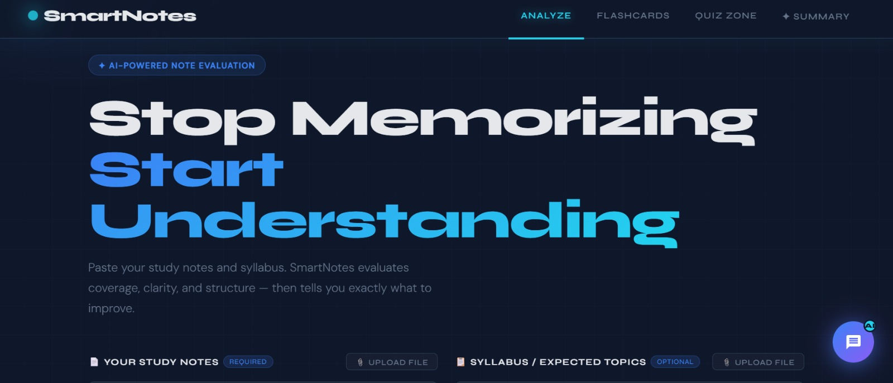
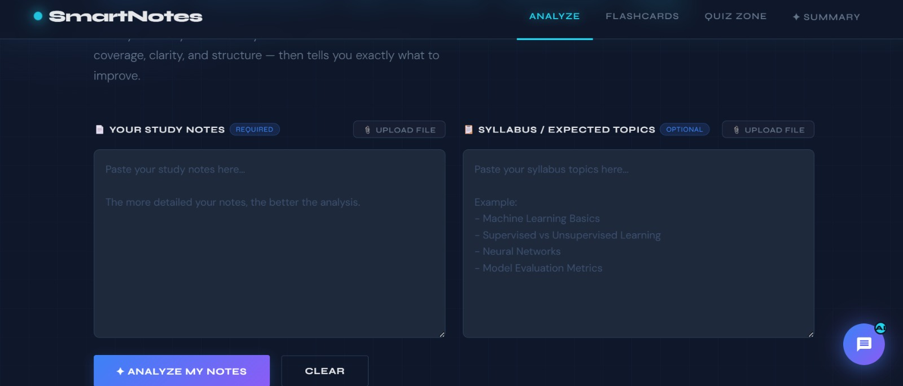
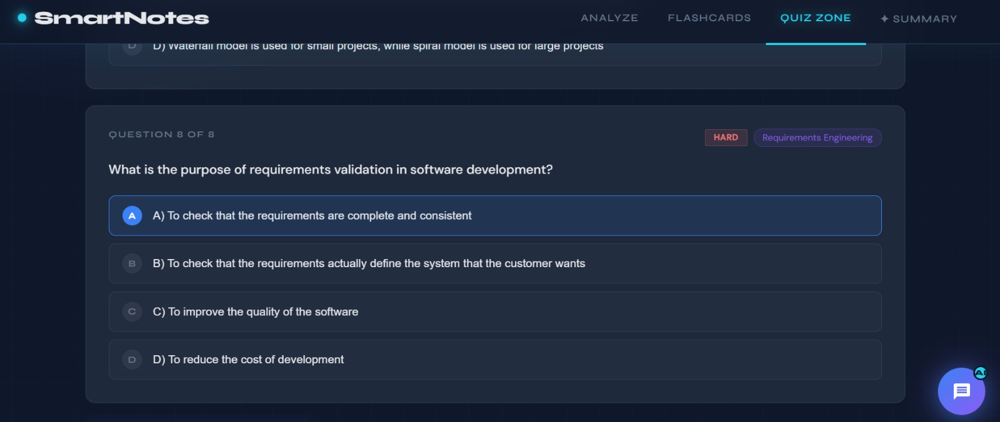
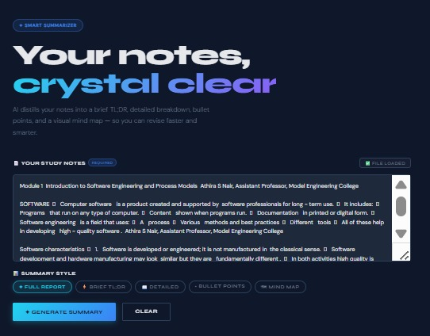
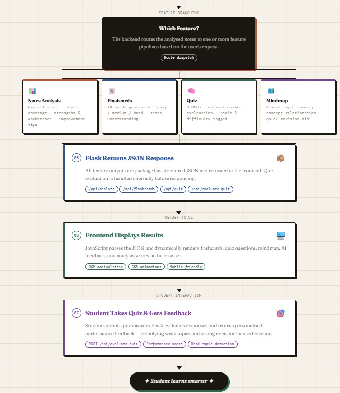

<p align="center">
  
</p>

# SmartNotes 🎯

## Basic Details

### Team Name: Stack

### Team Members
- Member 1: Jiya Mary Jacob - Model Engineering college
- Member 2: Joylin Alex - Model Engineering college

### Hosted Project Link
https://smart-notes-xe6l.vercel.app/

### Project Description
“Academic Notes Analyzer: A Flask + HTML app with an AI assistant that evaluates student notes, generates flashcards, quizzes, and mindmap summaries, providing personalized feedback to highlight strengths, weaknesses, and study suggestions for smarter learning.”

### The Problem statement
Students often take notes in various formats and styles, but the effectiveness of these notes varies widely due to inconsistencies, missing concepts, and poor structure. This makes it difficult for students to evaluate the quality of their notes, identify gaps in their learning, and revise efficiently.

### The Solution
 SmartNotes addresses this challenge by using artificial intelligence and natural language processing to analyze and assess the clarity, completeness, and structure of student notes. The system compares notes against syllabus standards or reference materials, highlights missing topics, and generates personalized flashcards and quizzes for effective revision. By providing actionable feedback and interactive learning resources, SmartNotes helps students study smarter, retain knowledge better, and improve overall academic performance.

---

## Technical Details

### Technologies/Components Used

**For Software:**
- Languages used: Python, HTML, CSS, JavaScript
- Frameworks used: Flask  
- Libraries used:  Groq, Flask-CORS, python-dotenv, Jinja2  
- Tools used: VS Code, Git, Vercel (for deployment)

---

## Features

List the key features of your project:
- **Notes Analysis:** Evaluate notes for completeness, clarity, structure, and topic coverage using AI.  
- **Flashcard Generation:** Create 10 AI-powered flashcards from notes with easy, medium, and hard difficulty.  
- **Quiz Creation & Evaluation:** Generate 8 multiple-choice questions and evaluate answers, highlighting weak and strong topics.  
- **Mindmap Summary:** Automatically generate a mindmap summary for quick revision.  
- **AI Assistant:** Provides personalized suggestions, improvements, and study guidance.  
- **Frontend:** HTML/CSS/JS interface for submitting notes and viewing analysis, flashcards, quizzes, and summaries.  

---

## Implementation

### For Software:

#### Installation
```bash
# Clone the repository
git clone https://github.com/JiyaJac/smartnotes.git
cd smartnotes/backend

# Install Python dependencies
pip install -r requirements.txt

# create .env file for API key
echo "GROQ_API_KEY=your_api_key_here" > .env
```

#### Run
```bash
# Run the Flask backend

python app.py
```
Open http://localhost:10000 to access the HTML frontend.


---

## Project Documentation

### For Software:

#### Screenshots (Add at least 3)

 
 
 
 
 

**evaluating various diffrent notes with the reference syllabus and generating a scoring system**
 
 
 
 
 
 

 **generating flash cards based on the input content**


 
 
 
 

 **generating quiz questions bassed on the topic. The answers are then evaluated and the weak areas are identified suggesting appropriate improvement.**


 
 
 
 
 
 

 **generating summary along with mind maps based on user preference.**

 
 
**chatting with an ai on topics related to the content uploaded.**

 
#### Diagrams

**System Architecture:**


SmartNotes is built on a lightweight three-tier architecture. The frontend is a simple HTML/CSS/JavaScript interface served by Flask via Jinja2 templates, where students submit their notes and interact with the results through AJAX calls. The backend is a Python Flask application that acts as the central orchestrator — it receives requests, engineers prompts, and exposes four core API endpoints: /api/analyze, /api/flashcards, /api/quiz, and /api/evaluate-quiz. For AI processing, the backend communicates with the Groq API, leveraging the llama-3.3-70b-versatile model to perform notes analysis, flashcard generation, quiz creation, and mindmap summarisation — all returning structured JSON that the frontend dynamically renders. Environment variables (managed via python-dotenv) keep sensitive credentials like the GROQ_API_KEY secure. The entire application is deployed as a single web service on Render, with static assets served from a /static folder and a straightforward build-and-start configuration, making it portable and easy to host on any Python-compatible platform.

**Application Workflow:**



The SmartNotes workflow begins when a student pastes their study notes into the frontend interface and submits them via an AJAX POST request. The Flask backend receives the payload, validates the input, and engineers structured prompts before making a call to the Groq LLM (llama-3.3-70b-versatile), which analyses the notes for completeness, clarity, and structure — returning a detailed JSON response with scores, topic coverage, strengths, and weaknesses. Based on the student's chosen feature, the backend then routes the request through one or more parallel pipelines — generating 10 flashcards of mixed difficulty, producing an 8-question multiple-choice quiz with explanations, building a mindmap summary of key concepts, or delivering personalised AI tutor feedback with study recommendations. All outputs are packaged as structured JSON and sent back to the frontend, where JavaScript dynamically renders the results in the browser. Finally, when the student submits their quiz answers, Flask evaluates the responses internally and returns personalised performance feedback — highlighting weak topics and strong areas — completing the full cycle from raw notes to actionable learning insights.

---

## Additional Documentation

### For Web Projects with Backend:

#### API Documentation

**Base URL:** 'https://smart-notes-xe6l.vercel.app/'

##### Endpoints

**GET /api/endpoint**
- **Description:** Submits student notes for analysis. Returns a JSON report with completeness, clarity, structure, strengths, weaknesses, and improvement suggestions.
- **Parameters:**
1. Analyze Notes (POST /api/analyze)
Parameters (in request body JSON):
notes (string): The content of the student’s notes to analyze. Required.
subject (string, optional): The subject or topic context for more accurate analysis.
2. Generate Flashcards (POST /api/flashcards)
Parameters (in request body JSON):
notes (string): The student notes to generate flashcards from. Required.
num_flashcards (integer): Number of flashcards to generate. Default is 10.
3. Generate Quiz (POST /api/quiz)
Parameters (in request body JSON):
notes (string): Notes used to generate quiz questions. Required.
num_questions (integer): Number of multiple-choice questions to generate. Default is 8.
4. Evaluate Quiz (POST /api/evaluate-quiz)
Parameters (in request body JSON):
quiz_id (string): Unique ID of the quiz being evaluated. Required.
answers (array of strings): User’s selected answers in order corresponding to quiz questions. Required.
- **Response:**
{
  "status": "success",
  "data": {
    "overall_score": 87,
    "topic_coverage": {
      "topic1": "complete",
      "topic2": "partial",
      "topic3": "missing"
    },
    "strengths": ["topic1", "topic4"],
    "weaknesses": ["topic2"],
    "suggestions": ["Expand topic2 with examples", "Organize topic3"]
  }
}
{
  "status": "success",
  "data": [
    {
      "question": "What is X?",
      "answer": "X is ...",
      "difficulty": "easy"
    },
    {
      "question": "Explain Y.",
      "answer": "Y is ...",
      "difficulty": "medium"
    }
  ]
{
  "status": "success",
  "data": [
    {
      "question": "What is Z?",
      "options": ["Option A", "Option B", "Option C", "Option D"],
      "correct_answer": "Option B",
      "topic": "Topic3",
      "difficulty": "hard"
    }
  ]
{
  "status": "success",
  "data": {
    "score": 6,
    "total_questions": 8,
    "weak_topics": ["Topic2"],
    "strong_topics": ["Topic1", "Topic4"],
    "recommendations": ["Review Topic2 concepts", "Revise examples from Topic3"]
  }
}
**POST /api/endpoint**
- **Description:** Submits student notes for AI analysis and returns a report with completeness, clarity, strengths, weaknesses, and improvement suggestions.
- **Request Body:**
```json
{
  "notes": "Content of student's notes",
  "subject": "Optional subject or topic for context"
}
```
- **Response:**
```json
{
  "status": "success",
  "data": {
    "overall_score": 87,
    "topic_coverage": {
      "topic1": "complete",
      "topic2": "partial",
      "topic3": "missing"
    },
    "strengths": ["topic1", "topic4"],
    "weaknesses": ["topic2"],
    "suggestions": ["Expand topic2 with examples", "Organize topic3"]
  }
}
```

---

## Project Demo

### Video
[Add your demo video link here - YouTube, Google Drive, etc.]

*Explain what the video demonstrates - key features, user flow, technical highlights*

### Additional Demos
[Add any extra demo materials/links - Live site, APK download, online demo, etc.]

---

## AI Tools Used (Optional - For Transparency Bonus)

If you used AI tools during development, document them here for transparency:

**Tool Used:** [e.g., GitHub Copilot, v0.dev, Cursor, ChatGPT, Claude]

**Purpose:** [What you used it for]
- Example: "Generated boilerplate React components"
- Example: "Debugging assistance for async functions"
- Example: "Code review and optimization suggestions"

**Key Prompts Used:**
- "Create a REST API endpoint for user authentication"
- "Debug this async function that's causing race conditions"
- "Optimize this database query for better performance"

**Percentage of AI-generated code:** [Approximately X%]

**Human Contributions:**
- Architecture design and planning
- Custom business logic implementation
- Integration and testing
- UI/UX design decisions

*Note: Proper documentation of AI usage demonstrates transparency and earns bonus points in evaluation!*

---

## Team Contributions

- [Name 1]: [Specific contributions - e.g., Frontend development, API integration, etc.]
- [Name 2]: [Specific contributions - e.g., Backend development, Database design, etc.]
- [Name 3]: [Specific contributions - e.g., UI/UX design, Testing, Documentation, etc.]

---

## License

This project is licensed under the [LICENSE_NAME] License - see the [LICENSE](LICENSE) file for details.

**Common License Options:**
- MIT License (Permissive, widely used)
- Apache 2.0 (Permissive with patent grant)
- GPL v3 (Copyleft, requires derivative works to be open source)

---

Made with ❤️ at TinkerHub
